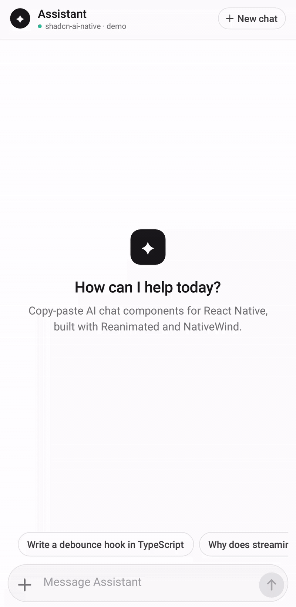

<div align="center">

# shadcn-ai-native

**Beautiful AI chat components for React Native & Expo. Copy, paste, ship.**

Streaming bubbles · Code blocks · Auto-growing prompt input · Action chips

[](./LICENSE)


[](https://github.com/Alfaro134/shadcn-ai-native)



</div>

---

## Why this exists

Every app is shipping an AI assistant, and on the web you can have a polished chat UI in an afternoon. In React Native it's a different story:

- Streaming text makes bubbles **jump and jitter** on every token.
- The **keyboard** covers your input on one platform and leaves a gap on the other.
- The input needs to **grow with the text**, cap its height, then scroll.
- Code answers need a **readable, copyable** code block, not a wall of monospace.

You end up rebuilding the same four components in every project, and they rarely feel smooth.

**shadcn-ai-native** gives you those components, done right, as plain `.tsx` files you **own**. It follows the [shadcn/ui](https://ui.shadcn.com) approach: no npm package, no version lock-in, no hidden styles. Copy a file into your project and change anything you like.

## ✨ Features

- 🌊 **Smooth streaming.** Bubbles ease into their new height on every chunk, so the text grows without jumps. There's a blinking caret while tokens arrive and a typing indicator before the first one.
- 🎨 **Built-in syntax highlighting.** A small regex highlighter colors keywords, strings, comments, numbers, function calls and types for JS/TS, Python, shell and more. **No highlighting library** needed.
- 📋 **One-tap copy.** Code blocks copy to the clipboard with an animated ✓ confirmation.
- ⌨️ **Keyboard handling on both platforms.** The prompt input follows the keyboard frame by frame on the UI thread, including on Android edge-to-edge.
- 📏 **Auto-growing input.** Grows line by line up to a max height, then scrolls. The action button switches between **Send** and **Stop generating**.
- 🪄 **Animated action chips.** "Regenerate", "Copy", "Explain simpler" and your own chips fade in and slide up one after another.
- 🌗 **Dark mode.** Every class has a `dark:` variant and follows the system theme.
- 🧩 **Few dependencies.** Only React Native, NativeWind and Reanimated, plus `expo-clipboard` for the code block. Icons are drawn with plain `View`s.
- 🎛️ **Easy to restyle.** Each file starts with a `theme` object of Tailwind classes. Change the colors there.
- 🔒 **Fully typed.** Strict TypeScript with documented props.

## 🧱 Components

| Component | What it does |
| --- | --- |
| [`StreamingChatBubble`](./components/ai/StreamingChatBubble.tsx) | User/assistant message bubble with smooth streaming growth, `**bold**`, `` `inline code` `` and ```` ``` ```` fenced code rendered as `<CodeBlock />`. |
| [`CodeBlock`](./components/ai/CodeBlock.tsx) | Dark code block with language header, syntax highlighting, horizontal scroll, optional line numbers and copy-to-clipboard. |
| [`DynamicPromptInput`](./components/ai/DynamicPromptInput.tsx) | Chat input with auto-grow, keyboard avoidance, attach button and a Send ⇄ Stop button. |
| [`ActionChips`](./components/ai/ActionChips.tsx) | Horizontal row of suggestion chips with a staggered entrance animation. |

## 🚀 Installation

> Already using NativeWind v4 and Reanimated? Skip to [step 3](#3-install-expo-clipboard).

### 1. Install Reanimated

```bash
npx expo install react-native-reanimated react-native-worklets
```

On Expo SDK 54+, `babel-preset-expo` configures the Reanimated Babel plugin automatically.

### 2. Install and configure NativeWind v4

```bash
npx expo install nativewind react-native-safe-area-context
npx expo install --dev tailwindcss@^3.4.17 babel-preset-expo
npx tailwindcss init
```

**`tailwind.config.js`:** point `content` at your app and at the folder you'll paste the components into:

```js
/** @type {import('tailwindcss').Config} */
module.exports = {
  content: ["./app/**/*.{ts,tsx}", "./components/**/*.{ts,tsx}"],
  presets: [require("nativewind/preset")],
  theme: { extend: {} },
  plugins: [],
};
```

**`global.css`:**

```css
@tailwind base;
@tailwind components;
@tailwind utilities;
```

**`babel.config.js`:**

```js
module.exports = function (api) {
  api.cache(true);
  return {
    presets: [["babel-preset-expo", { jsxImportSource: "nativewind" }], "nativewind/babel"],
  };
};
```

**`metro.config.js`:**

```js
const { getDefaultConfig } = require("expo/metro-config");
const { withNativeWind } = require("nativewind/metro");

const config = getDefaultConfig(__dirname);

module.exports = withNativeWind(config, { input: "./global.css" });
```

**`nativewind-env.d.ts`** (TypeScript support for `className`):

```ts
/// <reference types="nativewind/types" />
```

Finally, import the stylesheet once at your app's entry point (`app/_layout.tsx` or `App.tsx`):

```tsx
import "./global.css";
```

### 3. Install expo-clipboard

`CodeBlock` uses it for the copy button:

```bash
npx expo install expo-clipboard
```

### 4. Copy the components

Create `components/ai/` and paste in the files you need, either from the [`components/ai`](./components/ai) folder on GitHub or with curl:

```bash
mkdir -p components/ai && cd components/ai
BASE=https://raw.githubusercontent.com/Alfaro134/shadcn-ai-native/main/components/ai

curl -O $BASE/StreamingChatBubble.tsx
curl -O $BASE/CodeBlock.tsx          # required by StreamingChatBubble
curl -O $BASE/DynamicPromptInput.tsx
curl -O $BASE/ActionChips.tsx
```

Each file stands on its own, except `StreamingChatBubble`, which imports `./CodeBlock`.

## 💬 Usage example

A complete chat screen in about 40 lines:

```tsx
import { FlatList, View } from "react-native";
import { useSafeAreaInsets } from "react-native-safe-area-context";

import { ActionChips } from "@/components/ai/ActionChips";
import { DynamicPromptInput } from "@/components/ai/DynamicPromptInput";
import { StreamingChatBubble } from "@/components/ai/StreamingChatBubble";

export default function ChatScreen() {
  const insets = useSafeAreaInsets();
  const { messages, streamingId, send, stop, regenerate } = useYourChat(); // your AI hook

  return (
    <View className="flex-1 bg-white dark:bg-zinc-950">
      <FlatList
        inverted
        data={[...messages].reverse()}
        keyExtractor={(m) => m.id}
        keyboardDismissMode="interactive"
        renderItem={({ item }) => (
          <StreamingChatBubble
            role={item.role}
            content={item.content}
            isStreaming={item.id === streamingId}
            footer={
              item.role === "assistant" && item.id !== streamingId ? (
                <ActionChips
                  contentContainerClassName="px-0"
                  chips={[
                    { id: "regen", label: "Regenerate", onPress: regenerate },
                    { id: "simpler", label: "Explain simpler", onPress: () => send("Explain that simpler") },
                  ]}
                />
              ) : null
            }
          />
        )}
      />

      <DynamicPromptInput
        onSend={send}
        onStop={stop}
        onAttach={() => {/* open a picker */}}
        isGenerating={streamingId !== null}
        bottomInset={insets.bottom}
      />
    </View>
  );
}
```

`CodeBlock` can also be used on its own:

```tsx
<CodeBlock language="tsx" code={source} showLineNumbers />
```

### Keyboard handling, in one sentence

Put `DynamicPromptInput` at the bottom of a `flex-1` screen and **don't** wrap it in a `KeyboardAvoidingView`. It already tracks the keyboard with Reanimated's `useAnimatedKeyboard`. If a parent already handles the keyboard, pass `avoidKeyboard={false}`.

## 🎨 Customization

Every component starts with a `theme` object. That's where the look lives:

```tsx
const theme = {
  bubble: {
    user: "rounded-3xl rounded-br-lg bg-zinc-900 px-4 py-2.5 dark:bg-zinc-100",
    assistant: "rounded-3xl rounded-tl-lg bg-zinc-100 px-4 py-3 dark:bg-zinc-800/80",
  },
  // ...
};
```

For example, change `bg-zinc-900` to `bg-indigo-600` to give user bubbles your brand color. Syntax colors live in `CodeBlock`'s `theme.syntax`.

## 📱 Run the demo

The [`example/`](./example) folder is an Expo SDK 57 app. It imports the components straight from `../components`, the same way your app would after pasting them in.

```bash
cd example
npm install
npx expo start
```

Scan the QR code with **Expo Go**, or press `i` / `a` for a simulator. The demo streams simulated AI replies, including a highlighted code block, so you can try everything without an API key.

## 🤝 Contributing

Contributions are welcome, especially new components (message actions, attachment previews, markdown tables, voice input…). Please:

1. Keep components **copy-paste friendly**: one file, no new runtime dependencies.
2. Put all styling in the file's `theme` object with `dark:` variants.
3. Try your change in the `example/` app on both iOS and Android.

## 📄 License

[MIT](./LICENSE) © 2026 Josué E. Alfaro

Free to use in personal and commercial projects. If it saved you a weekend, a ⭐ helps a lot.
